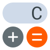
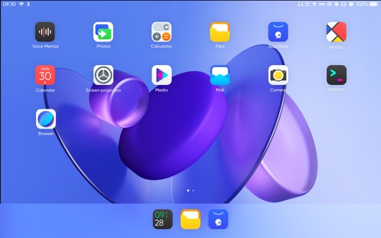

# Jing-Kalk 
Jing-Kalk is based on Kalk [gitlab](https://invent.kde.org/plasma-mobile/kalk).

Jing-Kalk is a beautifully designed calculator that conforms to the JingOS style and Integrating the interactive experience of pad and PC.


## Features
* Basic calculation

* Run on JingOS platform

* Brand new UI & UE with JingOS-style , based on JingUI Framework

* Support keyboard & touchpad & mouse & screen touch

* All keys support pressed / hovered effects

* Well-designed UI material:

  * Font
  * Icon
  * Picture
  * Touch effect
  

## Screenshots

JIng-Kalk:


JingOS:



## Links
* Home page: https://www.jingos.com/
* Project page: https://github.com/JingOS-team/jing-kalk
* Issues: https://github.com/JingOS-team/jing-kalk/issues
* Development channel: https://forum.jingos.com/


## Dependencies

* Qt5 

* Cmake

* KI18n

* Kirigami (JingOS Version)

* KConfig

* GNU Bison

* Flex

  

## Building and Installing

```sh
mkdir build
cd build
cmake -DCMAKE_INSTALL_PREFIX=/path/to/prefix -G Ninja ..
ninja install # use sudo if necessary
```

Replace `/path/to/prefix` to your installation prefix.
Default is `/usr/local`.

## Licensing
GPLv3, see [this page](https://www.gnu.org/licenses/gpl-3.0.en.html).
